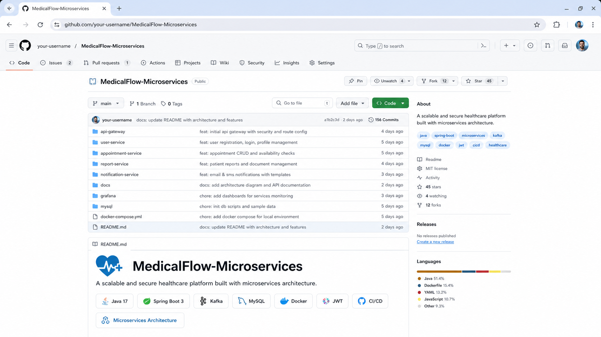
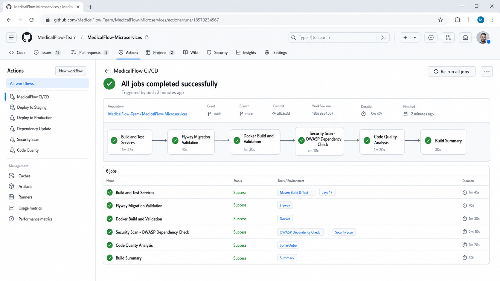
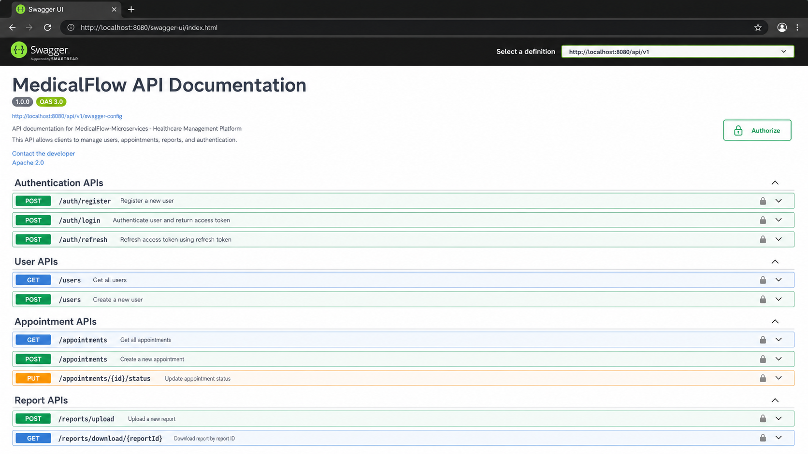
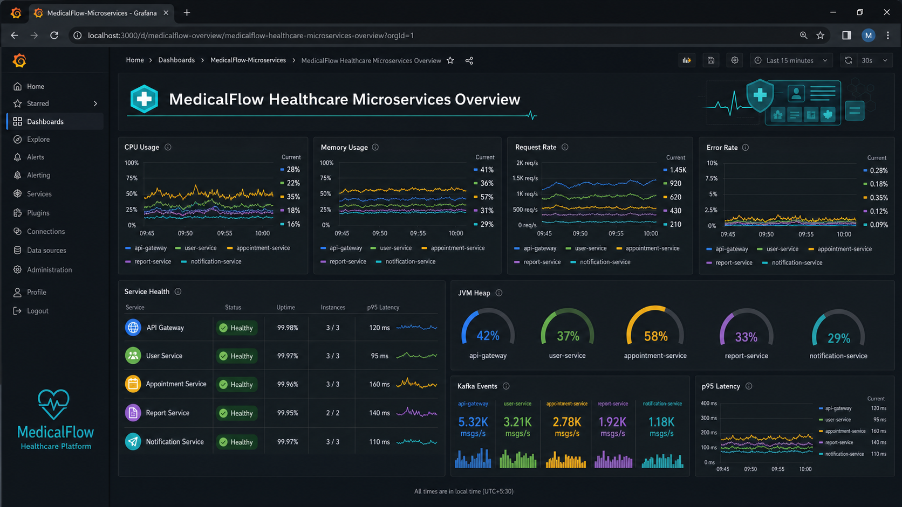
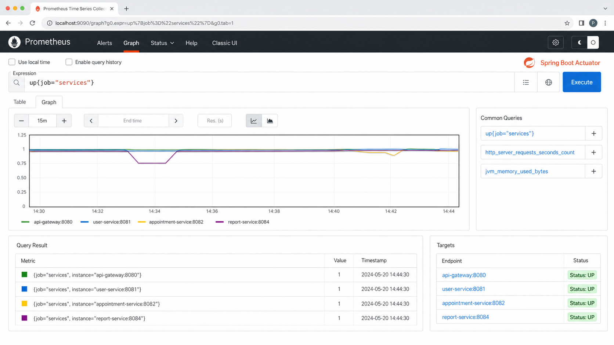
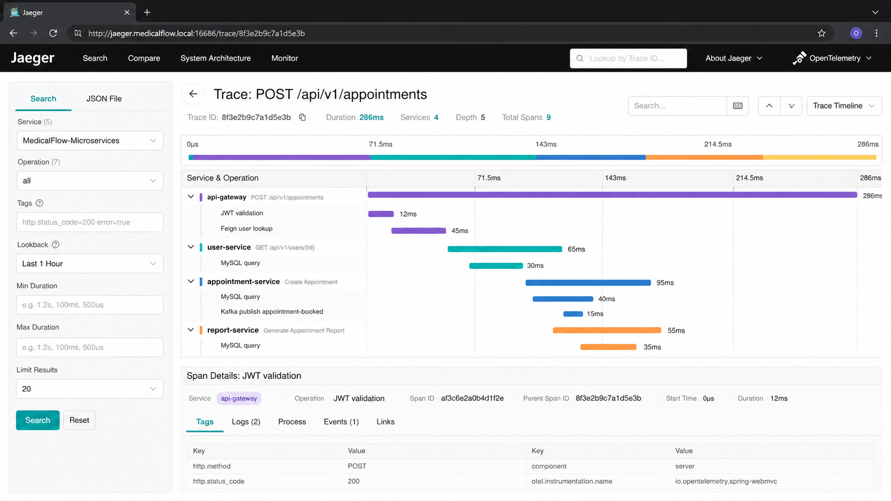
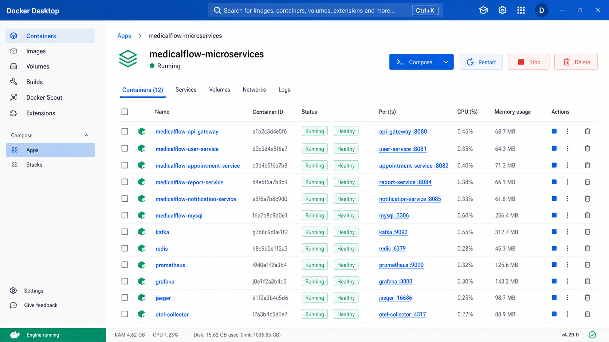

# MedicalFlow-Microservices 🏥

[](https://github.com/SaiChandrika001/MedicalFlow-Microservices/actions/workflows/ci-cd.yml)


MedicalFlow-Microservices is a production-oriented healthcare backend platform built with Java 17, Spring Boot 3, and a microservices architecture. It models core healthcare workflows such as user authentication, appointment scheduling, medical report management, asynchronous notifications, API gateway routing, distributed observability, and automated CI/CD validation.

This project is designed as a Senior Java Developer and AI Engineer portfolio system, with emphasis on clean service boundaries, secure APIs, event-driven communication, operational monitoring, and deployable infrastructure.

---

## 📌 Project Overview

MedicalFlow provides a distributed backend for a healthcare application where patients, doctors, and administrators can securely interact with appointment and medical report workflows.

The system is split into independently deployable services, each owning a specific business capability and database schema. Cross-service integration is handled through REST, API Gateway routing, Kafka events, Redis-backed gateway rate limiting, and centralized monitoring.

Key goals:

- Secure healthcare user identity and role-based access control
- Appointment lifecycle management
- Medical report upload, metadata storage, and download support
- Kafka-based notification workflows
- Gateway-level routing, rate limiting, and security headers
- Observability through Prometheus, Grafana, Jaeger, OpenTelemetry, and structured logs
- CI/CD quality gates with Maven, Docker validation, Flyway validation, PMD, and OWASP Dependency Check

---

## 🧱 Architecture Overview

```text
                         +--------------------+
                         |      Client UI      |
                         | Web / Mobile / API  |
                         +----------+---------+
                                    |
                                    v
                         +--------------------+
                         |     API Gateway     |
                         | Routing | JWT | RL  |
                         +-----+---------+----+
                               |         |
                +--------------+         +----------------+
                v                                         v
       +----------------+                       +---------------------+
       |  User Service  |                       | Appointment Service |
       |  Auth | Users  |                       | Scheduling | Cache  |
       +--------+-------+                       +----------+----------+
                |                                          |
                v                                          v
       +----------------+                       +---------------------+
       |  MySQL Users   |                       | MySQL Appointments  |
       +----------------+                       +---------------------+

                +----------------+                       +----------------------+
                | Report Service |                       | Notification Service |
                | Reports | Files|                       | Email | Consumers    |
                +--------+-------+                       +----------+-----------+
                         |                                          ^
                         v                                          |
                +----------------+                       +----------+-----------+
                | MySQL Reports  |                       |        Kafka         |
                +----------------+                       | user-registered      |
                                                         | appointment-booked   |
                                                         | appointment-cancelled|
                                                         | report-uploaded      |
                                                         +----------------------+

       +---------------------------------------------------------------------+
       | Observability: Prometheus | Grafana | Jaeger | OpenTelemetry | Logs |
       +---------------------------------------------------------------------+
```

### Architecture Documentation

Full enterprise architecture diagrams are available in:

- [Architecture Documentation](docs/ARCHITECTURE.md)
- [Draw.io Editable Diagram](docs/diagrams/medicalflow-enterprise-architecture.drawio)

After exporting the Draw.io file to PNG, add the image under `docs/assets/` and reference it here:

```md

```

---

## ✨ Features

- 🔐 JWT authentication with access tokens and refresh tokens
- 👥 Role-based access control for `PATIENT`, `DOCTOR`, and `ADMIN`
- 🧾 User registration, login, profile lookup, token refresh, and logout
- 📅 Appointment creation, update, cancellation, filtering, pagination, and status management
- 📁 Medical report upload, metadata retrieval, download, presigned URL support, and deletion
- 📬 Notification service with email delivery and Kafka consumers
- ⚡ Kafka events for user, appointment, and report workflows
- 🚪 API Gateway with route rewriting, JWT validation, rate limiting, CORS, and fallback support
- 🗄️ MySQL database per domain with Flyway migrations
- 🚀 Redis-backed gateway rate limiting and appointment caching support
- 📈 Prometheus metrics and Grafana dashboards
- 🔎 Distributed tracing through OpenTelemetry and Jaeger
- 🐳 Dockerfiles for services and Docker Compose orchestration
- ✅ GitHub Actions CI/CD pipeline with tests, Docker builds, Flyway validation, code quality checks, and OWASP Dependency Check

---

## 🛠️ Technology Stack

| Category | Technologies |
| --- | --- |
| Language | Java 17 |
| Framework | Spring Boot 3, Spring Web, Spring Security, Spring Data JPA |
| Architecture | Microservices, API Gateway, REST APIs, Event-Driven Architecture |
| Gateway | Spring Cloud Gateway, Redis Rate Limiter, Resilience4j |
| Security | JWT, Refresh Tokens, RBAC, Security Headers, CORS |
| Database | MySQL 8, Flyway |
| Messaging | Apache Kafka, Spring Kafka |
| Cache / Rate Limiting | Redis |
| Observability | Spring Boot Actuator, Micrometer, Prometheus, Grafana, OpenTelemetry, Jaeger |
| Documentation | Springdoc OpenAPI / Swagger UI |
| Build Tool | Maven |
| Containers | Docker, Docker Compose |
| CI/CD | GitHub Actions |
| Security Scanning | OWASP Dependency Check |
| Code Quality | PMD, Sonar configuration |

---

## 🧩 Microservices Description

| Service | Port | Responsibility |
| --- | ---: | --- |
| API Gateway | `8080` | Single entry point for clients, route rewriting, JWT validation, rate limiting, security headers, CORS, and fallback behavior |
| User Service | `8081` | User registration, login, profile management, JWT generation, refresh token lifecycle, RBAC, and user events |
| Appointment Service | `8082` | Appointment scheduling, status transitions, pagination, doctor/patient appointment views, audit logging, caching, and appointment events |
| Report Service | `8084` | Medical report upload, metadata management, file download, optional S3 integration, and report events |
| Notification Service | `8085` | Kafka event consumption and email notifications for user, appointment, and report workflows |

---

## 🔐 Security Features

- JWT access token authentication
- Refresh token rotation and invalidation
- Role-based method security with Spring Security annotations
- Gateway-level JWT authentication
- Gateway rate limiting using Redis
- Secure CORS configuration
- Security headers filter in API Gateway
- Password hashing through Spring Security
- Centralized exception handling
- OWASP Dependency Check in CI/CD
- Audit logging for sensitive appointment actions

Example authenticated request:

```bash
curl -H "Authorization: Bearer <access-token>" \
  http://localhost:8080/api/v1/users/profile
```

---

## ⚡ Event-Driven Architecture

Kafka is used to decouple domain events from notification delivery.

| Producer | Topic | Consumer | Purpose |
| --- | --- | --- | --- |
| User Service | `user-registered` | Notification Service | Send welcome email after successful registration |
| Appointment Service | `appointment-booked` | Notification Service | Send appointment confirmation |
| Appointment Service | `appointment-cancelled` | Notification Service | Send cancellation notification |
| Report Service | `report-uploaded` | Notification Service | Notify patient when a report becomes available |

Event flow:

```text
Domain Action -> Service Publishes Event -> Kafka Topic -> Notification Service -> Email Delivery
```

---

## 📊 Monitoring & Observability

MedicalFlow includes a practical observability stack for local and containerized environments.

| Tool | URL | Purpose |
| --- | --- | --- |
| Prometheus | `http://localhost:9090` | Metrics scraping and querying |
| Grafana | `http://localhost:3000` | Dashboards and service visualization |
| Jaeger | `http://localhost:16686` | Distributed tracing UI |
| API Gateway Actuator | `http://localhost:8080/actuator` | Gateway health, metrics, Prometheus endpoint |
| User Service Actuator | `http://localhost:8081/actuator` | User service health and metrics |
| Appointment Service Actuator | `http://localhost:8082/actuator` | Appointment service health and metrics |
| Report Service Actuator | `http://localhost:8084/actuator` | Report service health and metrics |

Grafana default credentials:

```text
Username: admin
Password: admin
```

Pre-provisioned dashboards are available in:

```text
grafana/dashboards/
```

---

## 🚀 CI/CD Pipeline

GitHub Actions workflow: `.github/workflows/ci-cd.yml`

Pipeline stages:

1. Build and test each Maven service
2. Validate Flyway migrations
3. Validate Docker Compose configuration
4. Build Docker images for core services
5. Run OWASP Dependency Check
6. Run PMD code quality checks
7. Publish build summary

Workflow triggers:

- Push to `main`
- Push to `feature/**`
- Push to `modernize/**`
- Pull requests targeting `main`
- Manual workflow dispatch

---

## 📁 Project Structure Tree

```text
MedicalFlow-Microservices/
├── .github/
│   └── workflows/
│       └── ci-cd.yml
├── api-gateway/
│   ├── src/main/java/com/medicalflow/apigateway/
│   ├── src/main/resources/
│   ├── Dockerfile
│   └── pom.xml
├── user-service/
│   ├── src/main/java/com/medicalflow/userservice/
│   ├── src/main/resources/db/migration/
│   ├── src/test/
│   ├── Dockerfile
│   └── pom.xml
├── appointment-service/
│   ├── src/main/java/com/medicalflow/appointmentservice/
│   ├── src/main/resources/db/migration/
│   ├── src/test/
│   ├── Dockerfile
│   └── pom.xml
├── report-service/
│   ├── src/main/java/com/medicalflow/reportservice/
│   ├── src/main/resources/db/migration/
│   ├── src/test/
│   ├── Dockerfile
│   └── pom.xml
├── notification-service/
│   ├── src/main/java/com/medicalflow/notificationservice/
│   ├── src/test/
│   ├── Dockerfile
│   └── pom.xml
├── grafana/
│   ├── dashboards/
│   └── provisioning/
├── mysql/
│   └── init.sql
├── docs/
├── docker-compose.yml
├── prometheus.yml
├── otel-collector-config.yml
├── sonar-project.properties
└── README.md
```

---

## 💻 Local Setup Instructions

### Prerequisites

- Java 17
- Maven 3.9+
- Docker Desktop
- MySQL 8
- Kafka
- Redis

### Clone Repository

```bash
git clone https://github.com/SaiChandrika001/MedicalFlow-Microservices.git
cd MedicalFlow-Microservices
```

### Create Databases

```sql
CREATE DATABASE IF NOT EXISTS medicalflow_users;
CREATE DATABASE IF NOT EXISTS medicalflow_appointments;
CREATE DATABASE IF NOT EXISTS medicalflow_reports;
```

### Configure Environment

Set environment variables or update each service's `application.properties` / `application.yml`:

```bash
export SPRING_DATASOURCE_USERNAME=root
export SPRING_DATASOURCE_PASSWORD=<your-password>
export SPRING_KAFKA_BOOTSTRAP_SERVERS=localhost:9092
export REDIS_HOST=localhost
export REDIS_PORT=6379
export JWT_SECRET=<your-strong-secret>
```

### Run Services Locally

Open separate terminals for each service:

```bash
cd user-service
mvn spring-boot:run
```

```bash
cd appointment-service
mvn spring-boot:run
```

```bash
cd report-service
mvn spring-boot:run
```

```bash
cd notification-service
mvn spring-boot:run
```

```bash
cd api-gateway
mvn spring-boot:run
```

### Run Tests

```bash
cd user-service && mvn test
cd ../appointment-service && mvn test
cd ../report-service && mvn test
cd ../api-gateway && mvn test
```

---

## 🐳 Docker Deployment Instructions

Build and start the platform:

```bash
docker compose up --build
```

Run in detached mode:

```bash
docker compose up --build -d
```

Stop containers:

```bash
docker compose down
```

Remove containers and volumes:

```bash
docker compose down -v
```

Service URLs:

| Component | URL |
| --- | --- |
| API Gateway | `http://localhost:8080` |
| User Service | `http://localhost:8081` |
| Appointment Service | `http://localhost:8082` |
| Report Service | `http://localhost:8084` |
| Notification Service | `http://localhost:8085` |
| MySQL | `localhost:3306` |
| Prometheus | `http://localhost:9090` |
| Grafana | `http://localhost:3000` |
| Jaeger | `http://localhost:16686` |

> Note: the compose file wires services to Kafka and Redis hostnames. Ensure Kafka and Redis are available in your target environment, or extend `docker-compose.yml` with Kafka and Redis services before running the full event-driven stack locally.

---

## 📚 API Endpoints Summary

Gateway base URL:

```text
http://localhost:8080/api/v1
```

### Authentication

| Method | Endpoint | Description | Access |
| --- | --- | --- | --- |
| `POST` | `/auth/register` | Register a new user | Public |
| `POST` | `/auth/login` | Login and receive access + refresh tokens | Public |
| `POST` | `/auth/refresh` | Rotate refresh token and issue new access token | Public |
| `POST` | `/auth/logout` | Invalidate refresh token | Public |

### Users

| Method | Endpoint | Description | Access |
| --- | --- | --- | --- |
| `GET` | `/users/profile` | Get authenticated user profile | Patient, Doctor, Admin |
| `GET` | `/users/{id}` | Get user by ID | Admin |
| `GET` | `/users/by-email?email=<email>` | Find user by email | Doctor, Admin |

### Appointments

| Method | Endpoint | Description | Access |
| --- | --- | --- | --- |
| `POST` | `/appointments` | Create appointment | Patient, Doctor, Admin |
| `GET` | `/appointments` | List authenticated user's appointments | Patient, Doctor, Admin |
| `GET` | `/appointments/{id}` | Get appointment details | Patient, Doctor, Admin |
| `GET` | `/appointments/doctor/{doctorId}` | List doctor's appointments | Doctor, Admin |
| `GET` | `/appointments/status/{status}` | Filter appointments by status | Patient, Doctor, Admin |
| `PUT` | `/appointments/{id}` | Update appointment | Patient, Admin |
| `PUT` | `/appointments/{id}/status` | Update appointment status | Patient, Doctor, Admin |
| `POST` | `/appointments/{id}/cancel` | Cancel appointment | Patient, Admin |
| `DELETE` | `/appointments/{id}` | Delete appointment | Patient, Admin |

### Reports

| Method | Endpoint | Description | Access |
| --- | --- | --- | --- |
| `POST` | `/reports/upload` | Upload medical report | Doctor, Admin |
| `GET` | `/reports` | List all reports with pagination | Admin |
| `GET` | `/reports/report/{reportId}` | Get report metadata | Patient, Doctor, Admin |
| `GET` | `/reports/{patientId}` | List reports by patient | Patient, Doctor, Admin |
| `GET` | `/reports/download/{reportId}` | Download report file | Patient, Doctor, Admin |
| `GET` | `/reports/download-url/{reportId}` | Get presigned report download URL | Patient, Doctor, Admin |
| `DELETE` | `/reports/{reportId}` | Delete report | Doctor, Admin |

### Notifications

| Method | Endpoint | Description | Access |
| --- | --- | --- | --- |
| `POST` | `/notifications/email` | Send email notification directly | Internal/Admin-oriented |

---

## 🧪 Sample API Usage

Register user:

```bash
curl -X POST http://localhost:8080/api/v1/auth/register \
  -H "Content-Type: application/json" \
  -d '{
    "fullName": "Dr. Jane Smith",
    "email": "jane.smith@medicalflow.com",
    "password": "StrongPassword123!",
    "role": "DOCTOR"
  }'
```

Login:

```bash
curl -X POST http://localhost:8080/api/v1/auth/login \
  -H "Content-Type: application/json" \
  -d '{
    "email": "jane.smith@medicalflow.com",
    "password": "StrongPassword123!"
  }'
```

Create appointment:

```bash
curl -X POST http://localhost:8080/api/v1/appointments \
  -H "Authorization: Bearer <access-token>" \
  -H "Content-Type: application/json" \
  -d '{
    "doctorId": 2,
    "appointmentDate": "2026-06-10T10:30:00",
    "reason": "General consultation"
  }'
```

---

## 🧭 Future Enhancements

- AI-assisted appointment triage and symptom summarization
- AI-based medical report summarization using LLMs
- Service discovery with Eureka or Consul
- Centralized configuration with Spring Cloud Config
- Kubernetes manifests and Helm charts
- API versioning strategy and generated API clients
- Dedicated audit service
- Dead-letter topics and retry topics for Kafka failure handling
- Testcontainers-based integration testing
- Centralized log aggregation with OpenSearch or ELK
- Role-aware patient and doctor dashboards
- Blue-green or canary deployment strategy

---

## 🖼️ Screenshots

Generated portfolio screenshots are available in [docs/SCREENSHOTS.md](docs/SCREENSHOTS.md).

### GitHub Repository Home Page



**Caption:** Professional GitHub repository homepage highlighting the README, project structure, badges, and enterprise backend positioning.

### GitHub Actions Pipeline



**Caption:** Successful CI/CD pipeline with Maven build, service tests, Docker validation, OWASP Dependency Check, and code quality analysis.

### Swagger API Documentation



**Caption:** Professional OpenAPI documentation for authentication, appointment, and report APIs.

### Grafana Healthcare Dashboard



**Caption:** Healthcare-themed Grafana dashboard covering CPU, memory, request rate, latency, Kafka events, and service health.

### Prometheus Actuator Metrics



**Caption:** Prometheus metrics dashboard showing Spring Boot Actuator data and microservice target health.

### Jaeger Distributed Tracing



**Caption:** Distributed trace waterfall across API Gateway, User Service, Appointment Service, Report Service, MySQL, and Kafka.

### Docker Containers Running



**Caption:** Docker Desktop runtime view showing MedicalFlow containers running with healthy service status and mapped ports.

---

## 👩‍💻 Author

**Sai Chandrika**  
Senior Java Developer | Microservices | Cloud-Native Backend Engineering | AI Engineering

- GitHub: [@SaiChandrika001](https://github.com/SaiChandrika001)
- Project: [MedicalFlow-Microservices](https://github.com/SaiChandrika001/MedicalFlow-Microservices)

---

## ⭐ Portfolio Note

MedicalFlow-Microservices demonstrates production-grade backend engineering practices across secure API design, distributed systems, asynchronous messaging, operational observability, database migrations, automated CI/CD, and healthcare-focused domain modeling.
