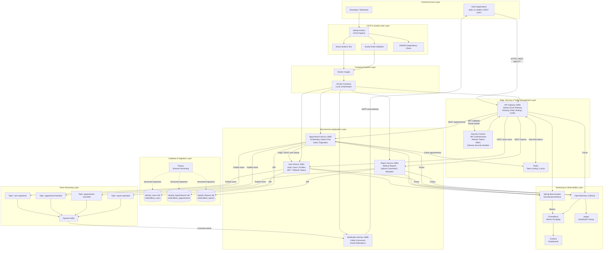
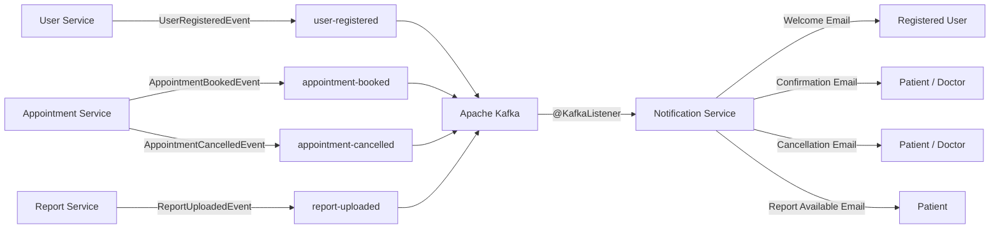
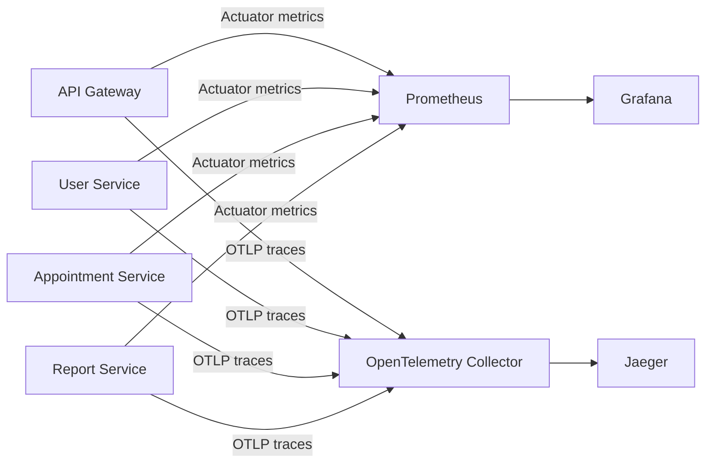
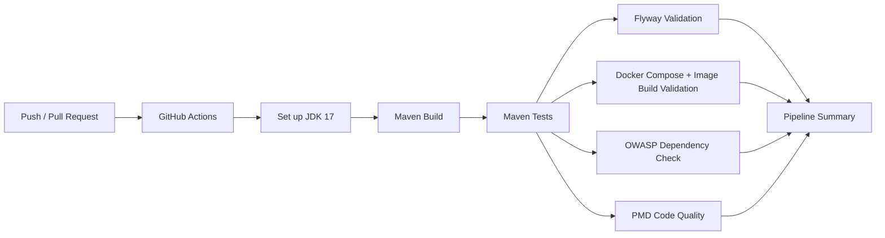
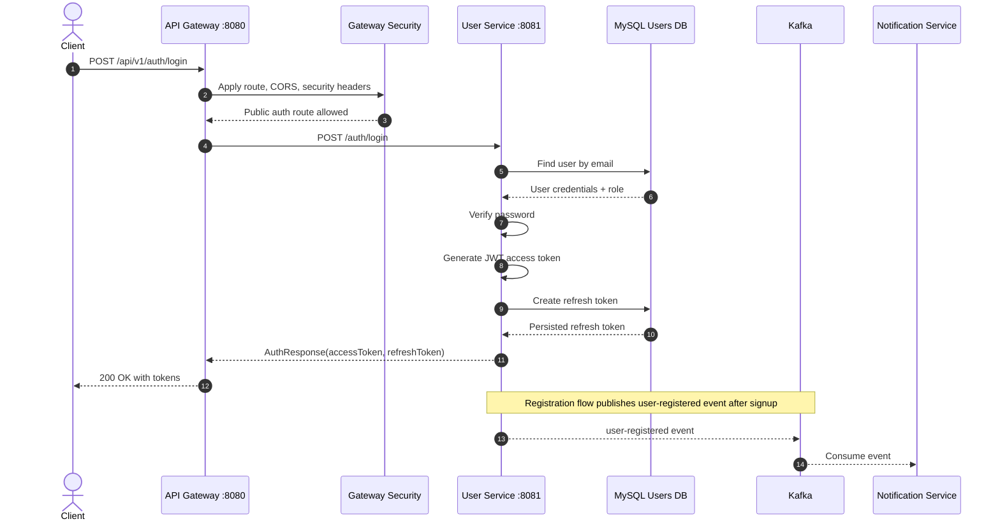
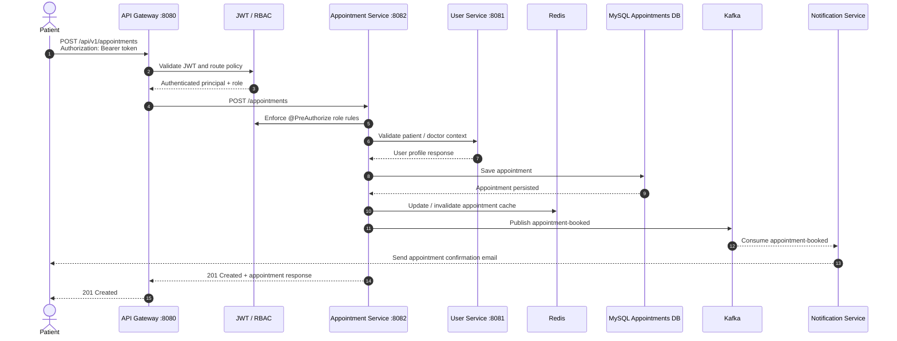
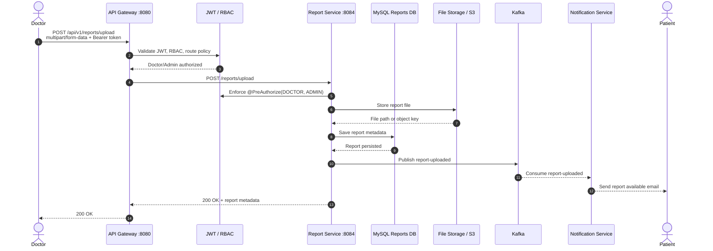

# MedicalFlow-Microservices Architecture

Enterprise-grade architecture documentation for **MedicalFlow-Microservices**, a healthcare management platform built with Java 17, Spring Boot 3, Spring Cloud Gateway, MySQL, Kafka, Redis, Docker, Prometheus, Grafana, Jaeger, OpenTelemetry, and GitHub Actions.

## System Architecture



## Enterprise Architecture View

| Layer | Components | Responsibility |
| --- | --- | --- |
| External Access | Client Applications, REST Clients | Initiate authenticated healthcare workflows |
| Edge & Security | API Gateway, JWT, Refresh Tokens, RBAC, Redis Rate Limiter | Centralized routing, authentication, authorization, traffic control |
| Application | User, Appointment, Report, Notification Services | Business capabilities with independent ownership |
| Data | MySQL Users DB, Appointments DB, Reports DB, Flyway | Domain-owned persistence and database migration governance |
| Messaging | Kafka topics | Asynchronous event propagation and service decoupling |
| Observability | Actuator, OpenTelemetry, Prometheus, Grafana, Jaeger | Health, metrics, distributed tracing, operational dashboards |
| CI/CD | GitHub Actions, Maven, Docker validation, OWASP Dependency Check | Automated build, test, security scanning, and deployment readiness |
| Runtime | Docker, Docker Compose | Local and containerized service orchestration |

## Kafka Event Flow



## Observability Flow



## CI/CD Pipeline



## Login Sequence Diagram



## Appointment Booking Sequence Diagram



## Report Upload Sequence Diagram



## Draw.io Compatible Architecture

The editable Draw.io source is available at:

```text
docs/diagrams/medicalflow-enterprise-architecture.drawio
```

Open it with [draw.io / diagrams.net](https://app.diagrams.net/) using **File -> Open From -> Device**.

## PNG-Style Layout Description

Use this layout when exporting to PNG for README, portfolio, or interview presentation decks:

- Canvas: 16:9 landscape, recommended size `1920x1080`.
- Style: enterprise architecture, clean white background, subtle grouped containers, consistent spacing, rounded rectangles, minimal shadows.
- Top row: External clients on the left, GitHub Actions CI/CD lane on the right.
- Center top: API Gateway as the main ingress node, with a security control band directly attached.
- Center row: four microservices arranged left to right: User Service, Appointment Service, Report Service, Notification Service.
- Data row: MySQL Users DB under User Service, MySQL Appointments DB under Appointment Service, MySQL Reports DB under Report Service; Flyway shown as a governance component connected to all three databases.
- Messaging row: Kafka centered between producer services and Notification Service; topics shown as individual topic boxes.
- Cache: Redis near API Gateway and Appointment Service, with arrows for rate limiting and cache access.
- Observability band: Prometheus, Grafana, OpenTelemetry Collector, and Jaeger in a bottom horizontal lane connected from Gateway and services.
- Arrows:
  - Solid blue arrows for synchronous REST calls.
  - Solid orange arrows for Kafka event publishing and consumption.
  - Dashed green arrows for metrics and tracing.
  - Purple arrows for CI/CD build and deployment readiness flow.
- Footer label: `MedicalFlow-Microservices | Java 17 | Spring Boot 3 | Kafka | MySQL | Observability | CI/CD`.

Suggested README image reference after PNG export:

```md

```
